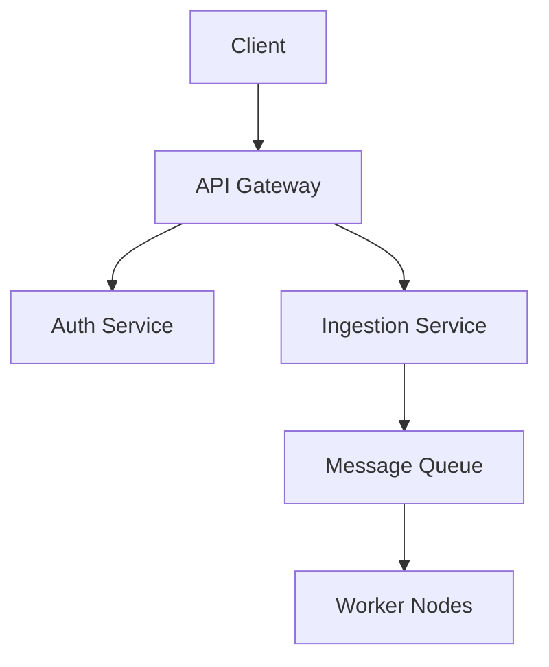

# Microservices Architecture

BMDRM is built on a scalable microservices architecture. This allows individual components to scale independently based on load.

## Core Services

1.  **Auth Service**: Handles JWT issuance and validation.
2.  **Ingestion Service**: High-throughput endpoint for raw data.
3.  **Processing Service**: Async workers (BullMQ) for data transformation.

## Communication Pattern

Services communicate primarily via **gRPC** for internal synchronous calls and **RabbitMQ** for asynchronous events.



## Database Sharding

We use a sharded PostgreSQL setup.

```sql
-- Example Sharding Key
CREATE TABLE events (
    id UUID PRIMARY KEY,
    user_id UUID NOT NULL,
    payload JSONB
) PARTITION BY HASH (user_id);
```
